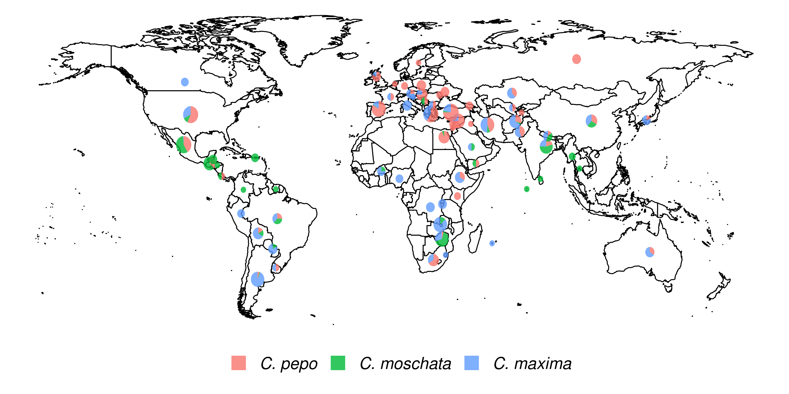

## Results

### Genotyping

Each *Cucurbita ssp.* collection was genotyped using the GBS approach. 
The collections comprised 534 accessions for *C. maxima*, 314 for *C. moschata*, and 829 for *C. pepo*. 
Figure {@fig:world} shows the geographical distribution of accessions broken down by species. 
*C. maxima* and *C. moschata* constitute the majority of accessions collected from Central and South America, whereas *C. pepo* accessions are more prevalent in North America and Europe. 
*C. pepo* had the highest number of raw SNPs (88,437) followed by *C. moschata* (72,025) and *C. maxima* (56,598). 
After filtering, *C. pepo* and *C. moschata* had a similar number of SNPs, around 30,000, whereas *C. maxima* had an order of magnitude fewer filtered SNPs (1599).
This discrepancy may be an artifact of using Pst1, a rarer base-cutter previously optimized for GBS of  *C. maxima* [@doi:10.1186/s12864-015-2312-8 ], rather than ApeK1 which was used for *C.pepo* and *C. moschata*. 
The number and distribution of SNPs across each chromosomes is shown in Table {@tbl:snp_info}. Maps of SNP distribution for each species are shown in Supplemental Figure {@fig:mrk}

{#fig:world} 

|           |*C. pepo* |         |*C. moschata* |         |*C. maxima* |         |
|:----------|:-------|:--------|:-----------|:--------|:---------|:--------|
|Chromosome |Raw     |Filtered |Raw         |Filtered |Raw       |Filtered |
|0          |12498   |2550     |2708        |546      |1501      |132      |
|1          |7497    |2831     |3890        |1468     |4185      |121      |
|2          |5153    |2049     |3661        |1538     |2101      |55       |
|3          |4875    |1943     |3472        |1499     |2201      |51       |
|4          |4598    |1982     |6880        |2553     |5703      |106      |
|5          |4045    |1628     |2716        |887      |3115      |46       |
|6          |3871    |1384     |3262        |1159     |3035      |92       |
|7          |3129    |1222     |2668        |969      |2705      |62       |
|8          |3875    |1583     |2348        |810      |2391      |61       |
|9          |3766    |1390     |3106        |995      |2750      |84       |
|10         |3585    |1488     |3550        |1327     |2297      |52       |
|11         |3227    |1216     |4336        |1830     |3713      |131      |
|12         |3089    |1163     |3711        |1330     |2026      |47       |
|13         |3434    |1350     |3106        |1280     |2131      |82       |
|14         |3543    |1291     |4753        |1929     |4317      |100      |
|15         |2640    |960      |3564        |1321     |2662      |58       |
|16         |3088    |1060     |2933        |1107     |2058      |100      |
|17         |2994    |1175     |2885        |1096     |2195      |86       |
|18         |3053    |1258     |3341        |1316     |1826      |46       |
|19         |3381    |1340     |2638        |990      |1793      |46       |
|20         |3096    |1155     |2497        |903      |1893      |41       |
|Total      |88437   |32018    |72025       |26853    |56598     |1599     |

Table: Distribution and number of raw and filtered SNPs per chromosome for each species {#tbl:snp_info}

### Population Structure and Genetic Diversity

{#fig:struc}

| Group|Species                                                           |                                                                 |                                          |
|-----:|:-----------------------------------------------------------------|:--------------------------------------------------------------------|:---------------------------------------------|
|    |*C. pepo*                                                           |*C. moschata*                                                          |*C. maxima*                                     |
|     1|Mixed Group; Many from Spain, Turkey, and Syria                   |Mostly from Mexico                                                   |Mixed;  Primarily from South America and Asia |
|     2|Wild subsp. *ovifera* var. *texana* and var. *ozarkana*; North American |Mostly Mexico and Guatemala                                          |Mixed; Primarily from Asia and Europe         |
|     3|Majority from Turkey                                              |Mostly from Mexico                                                   |Mostly from North Macedonia                   |
|     4|Majority from North Macedonia                                     |Mostly from Africa                                                   |Mostly from Argentina                         |
|     5|Majority from Egypt                                               |Mostly from India                                                    |Mostly Turkey, Iran, Afghanistan              |
|     6|Majority from Mexico                                              |Mixed origin Europe and Americas;Many similar to cheese or neck type |Mostly from Africa                            |
|     7|Majority from Syria                                               |                                                                     |                                              |
|     8|Majority from Pakistan and Afghanistan                            |                                                                     |                                              |
|     9|Majority from Spain                                               |                                                                     |                                              |
|    10|Wild subsp. *fraterna*; Central American                            |                                                                     |                                              |

Table: Commonalities among accessions in each group, most groupings are dictated by geography. {#tbl:struc_info}

{#fig:cult}

Filtered SNPs were used for population structure analysis. 
Available geographical, phenotypic, and other metadata were retrieved from GRIN and were used to help interpret structure results. 
Results from model-based admixture analysis are shown in Figure {@fig:struc} panel a. 
These data support 10 ancestral groups (**K**=10) in *C. pepo*, 6 in *C. moschata*, and 6 in *C. maxima* in each of the species respectively. 
Population structure was driven mostly by geography, except in *C. pepo* where the presence of different subspecies was responsible for some of the structure.
Commonalities among structure groups are described in Table {@tbl:struc_info}. 
The first two principal components (PCs) of the marker data are shown in Figure {@fig:struc} panel b. 
As with the model-based analysis, PCA  showed geography as a main driver of population structure with accessions being derived from Africa, the Arab States, Asia, Europe, North America, and South/Latin America. 
PC1 in *C. pepo* separates *C. pepo* subsp.*ovifera*, which have a North American Origin, from subsp. *pepo*. 

Ancestry proportions from admixture analysis were projected onto cultivars/market types identified in the accessions, which were excluded from the initial analysis used to infer ancestral groups. 
Cultivars were grouped according to known market class within species to help identify patterns in ancestry among and between market classes. 
Key market types identified in accessions from *C. pepo* including Acorn, Scallop, Crook, Pumpkin (jacko' lantern), Zuchinni, Marrow, Gem, and Other, the Other group consists of two accessions, which appear to be from Spaghetti; Neck, Cheese, Japonica, and Calabaza in *C. moschata*; and Buttercup, Kobocha, Hubbard, Processing, and Show (Giant squash) in *C. maxima*. 
These groupings are shown in Figure {@fig:cult}. 
In general, members of each market class exhibit similar ancestry proportions. 
In *C. pepo* market classes from the two different subspecies had distinct ancestry patterns. 
For example, Acorn, Scallop and Crook market classes are all from subsp. *ovifera* and all of these classes had similar ancestry proportions with roughly 20% of ancestry from the wild *ovifera*. 
In contrast, market classes within *pepo* had a small percentage of ancestry from wild *ovifera* and more ancestry in common with European and Asian accessions.
With *C. moschata*, neck and cheese type market classes showed very similar ancestry patterns, whereas the Japonica and Calabaza types were more distinct. 
Relative to the *C. pepo* and *C. moschata*, the *C. maxima* cultivars were less distinct from one another.

### Analysis of Phenotypic Data

All available historical data  from GRIN were compiled. 
Only traits with $\geq$ 100 entries were considered for further analysis. 
Filtering resulted in 26 traits for *C. pepo*, 5 for *C. moscahta* and 16 for *C. maxima*. 
Traits spanned fruit and agronomic-related characteristics, as well as pest resistances. 
The number of records for a given trait ranged from 108 to 822, with an average of  $\sim$ 270. 
Fruit traits included fruit width, length, surface color and texture, and flesh color and thickness. 
Agronomic data included plant vigor and vining habit, and several phenotypes related to maturity. 
Pest-related traits included susceptibility to cucumber beetle and squash bug in *C. pepo* and watermelon mosaic virus (WMV)  and powdery mildew (PM) in *C. maxima*. Supplemental Figure {@fig:pheno} shows the distribution of numeric traits. 
A detailed description of the traits is in Supplemental Table {@tbl:trait_description}.

### Genome-wide Association

{#fig:gwas}

Genome-wide association study was conducted for all traits using standard mixed-model analysis. 
A weak signal was detected in *C. moschata* on chromosome 3 for fruit length. 
Weak signals was detected in *C. maxima* for fruit ribbing on chromosome 17 and green fruit on chromosome 20. 
Five phenotypes were significantly associated with SNPs in *C. pepo*: bush/vine plant architecture on chromosome 10 using contemporary and historic data, fruit flesh thickness on chromosome 2, green fruit on chromosomes 2 and 19, and a non-significant, but clear signal for flesh color on chromosome 5. 
The bush/vine phenotype exhibited the strongest signal.
Manhatten plots for the GWAS results are shown in Figure {@fig:gwas}, and the corresponding quantile-quantile plots are shown in Supplemental Figure {@fig:qq}.

### Syntenty of *Bu* putative region in *C. pepo* and *C. maxima*
A candidate gene for dwarfism found in the species *C. maxima* was named Cma_004516 [@doi:10.1186/s12864-015-2312-8] and corresponds to the gene ID CmaCh03G013600 in the Cucurbit Genomics Database. 
The gene Cp4.1LG10g05740 on chromosome 10 in *C. pepo* was found to be orthologous to  CmaCh03G013600 and coincides with the region significantly associated with the bush/vine plant architecture phenotype identified by GWAS in the *C. pepo* collection.

### Development of a Core Collection

A core set of accessions that covered over 99% of total genetic diversity was identified in each of the panels. 
Roughly 5%-10% of the accessions were required to capture the genetic diversity in the panels (See Supplemental Figure ). 
This amounted to 117 accessions in *C. pepo*, 72 in  *C. moschata*, and 72 in *C.maxima*. 

